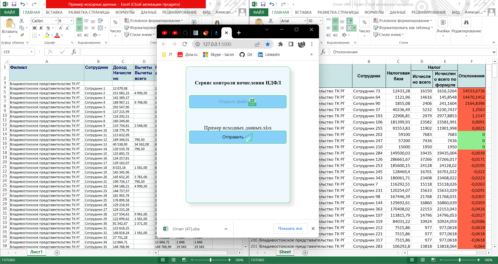

# Тестовый проект 3

Необходимо разработать сервис, проверяющий корректность исчисления НДФЛ сотрудникам. 

ТЗ:

•	Сделать веб-приложение на Flask/Django, с помощью которого пользователь может отправить файл с исходными данными и в ответ получить сформированный отчет, основанный на исходных данных;

•	Разработать алгоритм создания отчета в виде Excel файла с заданной шапкой таблицы (файл «Шапка отчета.xlsx»);

•	Отчет должен содержать следующие столбцы:
1.	Филиал (из исходных данных)
2.	Сотрудник (из исходных данных)
3.	Налоговая база (из исходных данных)
4.	Исчислено всего (из исходных данных)
5.	Исчислено всего по формуле (новый столбец)
6.	Отклонения (новый столбец) – если отклонений нет, то фон ячеек зеленый, иначе – красный

•	Формула новых столбцов:
1.	Исчислено всего по формуле – если «Налоговая база» < 5000000, то «Налоговая база» * 13%, иначе «Налоговая база» * 15%
2.	Отклонения (новый столбец) – «Исчислено всего» - «Исчислено всего по формуле»

•	Отчет должен быть отсортирован по убыванию по столбцу «Отклонения»

•	В отчете должны быть только значения, формул для столбцов быть не должно.

•	Из файла с исходными данными необходимо парсить только те столбцы, что указаны в 3 пункте с пометкой «из исходных данных».

### Внешний вид

